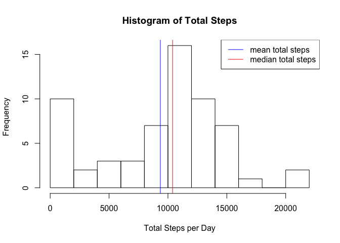
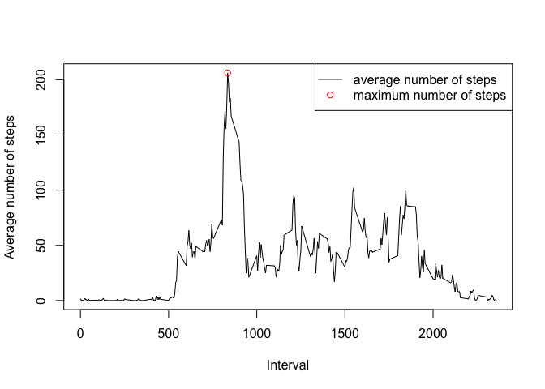
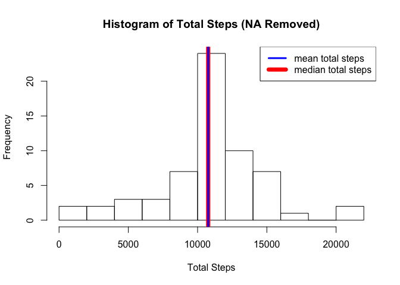

# Fitness Data
Fitness enthusiasts: what are they good for? Well apart from making me feel bad about myself, they like to track their fitness throughout the day--this includes step data.  In this report, I will be analyzing fitness step data and presenting the results from the following data set: [Activity monitoring data](https://d396qusza40orc.cloudfront.net/repdata%2Fdata%2Factivity.zip)


## Download the data set and load it into R
Below is the code used to download and load the data into R


```r
# download the data to the active directory, Rmd automatically sets it to the current directory

if(!dir.exists("./data")){dir.create("data")}

if(!file.exists("./data/activity.csv")){
    URL <- "https://d396qusza40orc.cloudfront.net/repdata%2Fdata%2Factivity.zip"
    zip_file<-"data.zip"
    download.file(URL,zip_file,method = "curl")

    system(paste0("unzip ",zip_file))
    system("mv activity.csv data")
    system("rm data.zip")
}

#read the csv file into the RStudio
activity <- read.csv("./data/activity.csv",header = T)
```

### The Raw Data
The raw data consists of three parameters and 17568 records.

* steps
    + The number of steps taken in that 5 minute interval
    + May be an integer or NA
* date
    + The date the readings took place
    + A date string "YYYY-MM-DD"
* interval 
    + An integer from 0-2355 in intervals of 5 indicating the HHMM that the readings took place
    + readings take place over 5 minute intervals
    
Below is an example of the raw data

```
##   steps       date interval
## 1    NA 2012-10-01        0
## 2    NA 2012-10-01        5
## 3    NA 2012-10-01       10
## 4    NA 2012-10-01       15
```

### The Cleaned Data
The raw data is already fairly clean, but we do make some processing steps.  Namely we convert the date data type.  We showcase the cleaning code and the some example of the data set


```r
# ensure that date variable is a date value
activity$date <- as.Date(activity$date,format = "%Y-%m-%d")
head(activity,4)
```

```
##   steps       date interval
## 1    NA 2012-10-01        0
## 2    NA 2012-10-01        5
## 3    NA 2012-10-01       10
## 4    NA 2012-10-01       15
```

### Auxiliary Functions


```r
# Function to parse out the interval time into an hour/minute time
parseInterval <- function(x){
    strint <- sprintf("%04d",x)
    hrstr <- substr(strint,1,2)
    mnstr <- substr(strint,3,4)
    
    final<-list(strFormat = paste0(hrstr,":",mnstr))
}
```


##  The Mean Total Steps per Day
We first calculate the total steps per day and set this into a new data table called total_steps.  This just contains a data table with each unique date, and the variable totalSteps which is the total steps made on that particular day.


```r
library(dplyr)
#we'll use the dplyr group_by and summarize methods to determine the total steps per day.  You may need to install the dpylr package first
total_steps <- activity %>% group_by(date) %>% summarize(totalSteps = sum(steps,na.rm = T))

mean_total_steps <- mean(total_steps$totalSteps, na.rm = T)
median_total_steps <- median(total_steps$totalSteps, na.rm = T)
```

Below is a distribution of the total steps made per day


```r
hist(total_steps$totalSteps,breaks = 10, 
     main = "Histogram of Total Steps",
     xlab = "Total Steps per Day",
     ylab = "Frequency")
abline(v = mean_total_steps, col = "blue")
abline(v = median_total_steps, col = "red")
legend("topright", 
       legend = c("mean total steps","median total steps"),
       col = c("blue","red"),
       lty = c(1,1))
```

<!-- -->

## Are There Any Differences between Weekdays and Weekends

Here we see that the mean number of steps per day is ``9354.23`` (rounded to 2 decimal places) and the median total steps per day is ``10395``.

## Average Daily Activity Pattern
Here we analyze the average daily activity pattern by looking at the average number of steps taken across all days for each 5 minute interval.  We similarly construct a new data frame using group_by and summarize


```r
interval_steps <- activity %>% group_by(interval) %>% summarize(avgSteps = mean(steps,na.rm = T))
head(interval_steps,4)
```

```
## # A tibble: 4 x 2
##   interval avgSteps
##      <int>    <dbl>
## 1        0    1.72 
## 2        5    0.340
## 3       10    0.132
## 4       15    0.151
```

We then plot these data as a time series


```r
plot(interval_steps$interval,interval_steps$avgSteps,type = "l",
     xlab = "Interval",
     ylab = "Average number of steps")
max_steps <- interval_steps[which(interval_steps$avgSteps == max(interval_steps$avgSteps)),]
points(max_steps,col = "red")
legend("topright",legend = c("average number of steps","maximum number of steps"),col = c("black","red"),lty = c(1,NA),pch = c(NA,1))
```

<!-- -->

We can see both from the graph and from analyzing the data that the maximum number of steps ``206.1698113`` (averaged over the days) occurs in the interval and time``835``.

## Correcting for Missing Values

We can either remove all missing values listed as ``NA`` or we can use interpolation techniques to replace the missing values.  In this section we replace the missing value for that interval with the mean value of that interval.  We create a separate dataset called `activity_narm` which contains replacements for the ``NA`` values.

```r
# count the number of NA values
num_na <- sum(is.na(activity$steps))
# create duplicate dataframe
activity_narm <- activity
for (i in 1:dim(activity_narm)[1]){
    if (is.na(activity_narm$steps[i])){
        # find interval in question
        tempint <- activity_narm$interval[i]
        #replace the Na value with the average
        activity_narm$steps[i] <- interval_steps[interval_steps$interval == tempint,]$avgSteps
    }
}
head(activity)
```

```
##   steps       date interval
## 1    NA 2012-10-01        0
## 2    NA 2012-10-01        5
## 3    NA 2012-10-01       10
## 4    NA 2012-10-01       15
## 5    NA 2012-10-01       20
## 6    NA 2012-10-01       25
```

```r
head(activity_narm)
```

```
##       steps       date interval
## 1 1.7169811 2012-10-01        0
## 2 0.3396226 2012-10-01        5
## 3 0.1320755 2012-10-01       10
## 4 0.1509434 2012-10-01       15
## 5 0.0754717 2012-10-01       20
## 6 2.0943396 2012-10-01       25
```

```r
head(interval_steps)
```

```
## # A tibble: 6 x 2
##   interval avgSteps
##      <int>    <dbl>
## 1        0   1.72  
## 2        5   0.340 
## 3       10   0.132 
## 4       15   0.151 
## 5       20   0.0755
## 6       25   2.09
```

We can create a second histogram to examine the distrubution of the steps with the `NA` values replaced with interval averages. 


```r
total_steps_narm <- activity_narm %>% group_by(date) %>% summarize(totalSteps = sum(steps,na.rm = T))

mean_total_steps_narm <- mean(total_steps_narm$totalSteps, na.rm = T)
median_total_steps_narm <- median(total_steps_narm$totalSteps, na.rm = T)

hist(total_steps_narm$totalSteps,breaks = 10, 
     main = "Histogram of Total Steps (NA Removed)",
     xlab = "Total Steps",
     ylab = "Frequency")
abline(v = median_total_steps_narm, col = "red",lwd = 7)
abline(v = mean_total_steps_narm, col = "blue", lwd = 3)
legend("topright", 
       legend = c("mean total steps","median total steps"),
       col = c("blue","red"),
       lwd = c(3, 7),
       lty = c(1,1))
```

<!-- -->

With the NA values removed the mean total steps taken per day is ``10766.19`` and the median total steps taken per day is ``10766.19``.  We notice here that doing it this way results in identical median and mean values.

## Are there differences in activity patterns between weekdays and weekends?

We now append onto our data sets a new field for weekdays. Using the `weekdays()` function we can return the weekday of the date.  Then we add the field that differentiates between weekday and weekends (Saturday and Sunday).


```r
#define the weekends

activity_narm$weekday <- weekdays(as.Date(activity_narm$date))
activity_narm$weekDayEnd <- sapply(activity_narm$weekday, 
                                   function(x) 
                                       if(x == "Saturday" 
                                          | x == "Sunday"){
                                           "Weekend"
                                           } 
                                   else{"Weekday"})
#create factors
activity_narm$weekDayEnd = factor(activity_narm$weekDayEnd)

interval_steps_narm_weekend <- activity_narm %>% group_by(weekDayEnd,interval) %>% summarize(avgSteps = mean(steps,na.rm = T))

head(interval_steps_narm_weekend)
```

```
## # A tibble: 6 x 3
## # Groups:   weekDayEnd [1]
##   weekDayEnd interval avgSteps
##   <fct>         <int>    <dbl>
## 1 Weekday           0   2.25  
## 2 Weekday           5   0.445 
## 3 Weekday          10   0.173 
## 4 Weekday          15   0.198 
## 5 Weekday          20   0.0990
## 6 Weekday          25   1.59
```

```r
library(ggplot2)

g <- ggplot(interval_steps_narm_weekend, aes(x = interval,y = avgSteps))+
    geom_line()+
    facet_grid(facets = weekDayEnd~.)
g
```

<!-- -->

Here we see that on weekdays, most individuals get their walking in early in the morning, likely before work.  That is when the peak walking occurs.  Later in the day (during work) they don't walk as often.  On weekends, however, we see a larger spread of walking throughout most of the daylight hours.  This suggests that folks walk consistently throughout the day on weekends.  On both weekends and weekdays we see little steps in the late night (after midnight = 0 and before 5am = 500).

